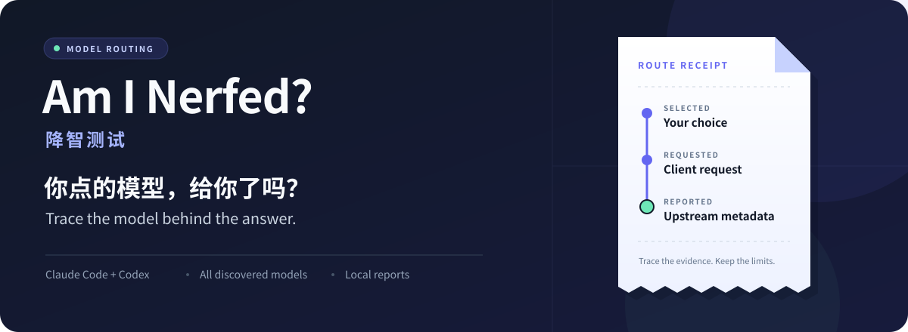

<p align="center"></p>

<p align="center"><a href="README.md">简体中文</a> · <a href="docs/methodology.md">Methodology</a> · <a href="CONTRIBUTING.md">Contributing</a> · <a href="LICENSE">MIT</a></p>

# Am I Nerfed? · 降智测试

[](https://github.com/mushanyoung/am-i-nerfed/actions/workflows/ci.yml)

**Trace the model behind the answer.**

One command scans installed Claude Code and Codex clients and probes every discoverable model. Compare requested and reported model identifiers, inspect aliases and visible fallback, and assess reasoning effort separately. Results stay local, with summaries for sharing.

With Python 3.9+ and official clients already signed in to your subscription, run directly—no pip, git, or virtual environment required:

```bash
curl -fsSL https://raw.githubusercontent.com/mushanyoung/am-i-nerfed/main/am-i-nerfed.py | python3 -
```

Live probes use existing **subscription sign-in** and consume the relevant allowance. Defaults cover all discovered models and the implemented subscription paths: Claude capture + direct control, and Codex CLI + HTTP. Add `--dry-run` to preview the plan without inference requests.

The result is observable routing evidence for those requests. Matching identifiers do not attest to backend weights, rule out hidden account flags, or measure intelligence. Differences need interpretation: aliases, configuration, and fallback all matter.

## Run directly

Pass arguments after `python3 -`; they are identical to the installed command's arguments:

```bash
# Probe only Claude Code
curl -fsSL https://raw.githubusercontent.com/mushanyoung/am-i-nerfed/main/am-i-nerfed.py | python3 - --tool claude

# Discover clients and models without inference requests
curl -fsSL https://raw.githubusercontent.com/mushanyoung/am-i-nerfed/main/am-i-nerfed.py | python3 - --dry-run

# Synthetic demo; no login or network needed after the download
curl -fsSL https://raw.githubusercontent.com/mushanyoung/am-i-nerfed/main/am-i-nerfed.py | python3 - demo
```

Or save the file to run it again later:

```bash
curl -fL https://raw.githubusercontent.com/mushanyoung/am-i-nerfed/main/am-i-nerfed.py -o am-i-nerfed.py
python3 am-i-nerfed.py
```

An existing checkout can run `python3 am-i-nerfed.py` from its root without installation. The standalone file embeds the project's release code and downloads no additional project code at runtime. It loads from a private temporary ZIP, which is cleaned up on exit. Every probe entry point defaults to `~/.am-i-nerfed/<run>/` on Linux and `runs/<run>/` under the current working directory elsewhere. An explicit `--out` always takes precedence.

Examples below use `am-i-nerfed`. For the standalone file, substitute `python3 am-i-nerfed.py`; for a pipe, append the same arguments after `python3 -`.

Sign in through the official CLI first. For Codex, use `codex login` and sign in with ChatGPT. API key access is a distinct authentication path. [Official OpenAI authentication docs](https://learn.chatgpt.com/docs/auth)

Intended for macOS / Linux. The Claude probe does not support native Windows; use WSL. Native Windows Codex paths are unverified. Python runtime dependencies are limited to the standard library.

## Optional: install a persistent command

Install the Python package if you want an `am-i-nerfed` command in your terminal:

```bash
python3 -m venv .venv
source .venv/bin/activate
python -m pip install --upgrade pip
python -m pip install 'git+https://github.com/mushanyoung/am-i-nerfed.git'
am-i-nerfed
```

Package installation uses GitHub or a local checkout; no PyPI publication is implied.

## Scan and select scope

The bare command is equivalent to `am-i-nerfed scan`. Both discover installed tools, read their model catalogs, and probe the candidates. If one tool or model fails, the scan continues with the others and records the failure.

Scans cover both implemented subscription paths for each provider by default. Claude runs the real client through the capture proxy and adds a direct-client control. Codex probes each model through both its real CLI and subscription HTTP. Reports distinguish the backends; success on one path does not establish success on another. “All paths” refers to these implemented subscription paths, not Bedrock, Vertex, or API key access.

```bash
# Inventory and sources, without inference requests
am-i-nerfed models
am-i-nerfed scan --dry-run

# Limit tools; --tool is repeatable
am-i-nerfed scan --tool claude

# Only Codex CLI; the default both also probes HTTP
am-i-nerfed scan --tool codex --codex-transport cli

# Keep Claude capture and disable its direct control
am-i-nerfed scan --tool claude --no-direct-control

# Select models; replace MODEL with a Codex ID from the inventory
am-i-nerfed scan --model claude:opus --model codex:MODEL

# Exclude a model, keeping the rest of the discovered inventory
am-i-nerfed scan --exclude-model claude:claude-haiku-4-5-20251001

# Set repetitions, effort, per-request timeout, and output directory
am-i-nerfed scan --tool codex --repeat 2 --effort high --timeout 120 --out runs/check
```

`--model` and `--exclude-model` accept `PROVIDER:MODEL` and are repeatable. Once `--model` is set, only those pairs are tested; other tools or models are not added automatically. Any `--tool` selection must include those providers. Exclusions match inventory IDs exactly: a `haiku` alias will not exclude an entry listed by its resolved full ID. An explicit `--effort` must be supported by each target. Use a fresh `--out` directory; existing results are not overwritten.

| Scan option | Behavior |
| --- | --- |
| `--include-hidden` | Also attempt hidden Codex entries; access is not guaranteed, and Claude has no equivalent catalog interface |
| `--discovery-timeout 30` | Catalog discovery timeout; 30 seconds by default |
| `--timeout 120` | Per-probe timeout; 120 seconds by default |
| `--effort LEVEL` | Override effort for all targets; otherwise Codex uses each catalog default or a supported low effort, while Claude keeps its client default |
| `--codex-transport both\|cli\|http` | Codex paths; defaults to `both`, recorded separately |
| `--no-direct-control` | Disable the Claude direct control enabled by default in scans; `--direct-control` remains accepted |
| `--ignore-alias-overrides` | Remove Claude family alias overrides in the subprocess |
| `--save-raw` | Explicitly retain Claude raw responses; keep them private |
| `-v` / `--verbose` | Show diagnostic detail; terminal output is concise by default |

`models` also supports `--tool`, `--include-hidden`, and `--discovery-timeout`.

Color is automatic when supported by the terminal; set `NO_COLOR=1` to disable it. Add `--verbose` when investigating discovery or request details, for example `am-i-nerfed --verbose`.

“All” means **the user-facing models discoverable from the clients in this run**, not every historical server model ID or a guarantee that each catalog entry is callable now. Authentication, client versions, caches, and account access affect discovery. Explicitly selected but missing tools, discovery failures, catalog fallbacks, and failed requests remain visible rather than counting as successful checks. `models` / `--dry-run` send no inference requests, but discovery may start official clients or read catalogs.

## Inspect a provider directly

Provider subcommands remain available for transport-specific controls. The Claude subcommand defaults to a single `haiku` probe; the bare command scans all discovered models.

```bash
am-i-nerfed claude -m opus --direct-control --out runs/claude
am-i-nerfed claude -m opus --ignore-alias-overrides --out runs/claude-clean
am-i-nerfed codex -m MODEL --out runs/codex
am-i-nerfed codex -m MODEL --via-codex --out runs/codex-cli
```

The Claude path runs the real client through a loopback capture proxy. `--direct-control` adds a run without the proxy, exposing CLI metadata rather than that control run's raw HTTP response. `--ignore-alias-overrides` removes alias overrides only from the probe subprocess. `ANTHROPIC_DEFAULT_*_MODEL` can change aliases; compare **selected → sent → reported**. [Official model configuration docs](https://code.claude.com/docs/en/model-config)

Claude requires a client with `--safe-mode`. The probe runs from an empty directory with project customization disabled, so it does not reproduce your normal project's full context.

Codex's default HTTP transport reuses file-based subscription credentials to inspect headers and stream events. **It uses an experimental internal interface that may change with client updates.** `--via-codex` runs the actual CLI with native authentication, including supported OS credential stores. Refresh expired login through the official client; the probe does not rewrite credentials. The two paths differ in context and transport and should be interpreted separately.

## Interpret the evidence

| Evidence | Question it can answer |
| --- | --- |
| Selection and outbound request | Did local configuration resolve the model differently? |
| Headers and start / completion events | Which model identifiers did the upstream report? |
| Fallback blocks and iteration metadata | Was a model transition visible in the stream? |
| Reasoning effort metadata | Can requested and reported effort be compared? |

Shared reports use `MATCH` / `CHANGED` / `UNKNOWN` for `route_status`, and `MATCH` / `CHANGED` / `NOT_REPORTED` / `NOT_REQUESTED` for `effort_status`. Model routing and effort are assessed independently. Missing fields, incomplete streams, and conflicting evidence do not become a match; `CHANGED` is an observed difference, not a capability ranking.

Claude direct controls are shown separately as `AGREES` / `DIFFERS` / `UNKNOWN`. An internal routing change in the direct client is labeled `CHANGED`, even when both paths return the same model. Codex can return nonzero when requested effort is not reported even if the model matches. Each short probe covers only its request, time, and path; scanning the catalog does not establish behavior across long sessions or a subscription period. [Methodology](docs/methodology.md)

Coverage `complete` means the planned models and backends have complete evidence, including enabled direct controls. Complete evidence may still show `CHANGED`; coverage and matching are separate judgments.

## Reports and offline demo

Results default to `~/.am-i-nerfed/<run>/` on Linux and `runs/<run>/` elsewhere; `--out` overrides the location. Share generated `share.md` / `share.json` or export a fresh summary from allowed fields. Shared summaries retain the backend and exclude accounts, request IDs, prompts, generated text, and raw errors. Preview them before posting.

A scan writes `inventory.json` (local sources, client paths, and warnings), `report.json` (normalized records and coverage), `share.json` / `share.md`, and per-model, per-path diagnostics under `probes/`. Keep the inventory and diagnostic reports private. Shared summaries retain coverage so partial success is not mistaken for a complete scan.

```bash
am-i-nerfed report runs/check/report.json --format markdown --output scan-summary.md
am-i-nerfed report runs/claude/report.json --format markdown --output summary.md
am-i-nerfed report runs/codex/report.json --format json --output summary.json
am-i-nerfed report runs/claude/report.json runs/codex/report.json --format svg --output summary.svg

# Synthetic: no login, network, or subscription usage
am-i-nerfed demo
am-i-nerfed demo --format svg --output demo.svg
```

[View the synthetic example card](docs/demo.svg)

Keep full diagnostic reports local. Claude's opt-in `--save-raw` can retain sensitive response content. Do not upload `~/.am-i-nerfed/`, `runs/`, credentials, or CLI logs. The project has no telemetry and does not upload results automatically. [SECURITY.md](SECURITY.md)

## Troubleshooting

| Situation | Action |
| --- | --- |
| Discovery fails for an installed tool | Inspect the catalog source and error; absence is not a passing check |
| Claude detects API key / gateway settings | Use a terminal configured for official subscription sign-in only |
| CLI lacks isolation flags | Update the official CLI |
| A listed model rejects the request | Distinguish catalog visibility from current access; retain the failure |
| Model matches but effort is absent | Keep `NOT_REPORTED`; requested effort is not reported effort |

Exit `0` means all required observed checks completed and matched, or inventory / offline output succeeded. Exit `2` means changes or inconclusive measurements; exit `1` means a preflight or operational failure. Argument errors may also return `2`. Automation should inspect report statuses instead of treating an exit code as proof of no degradation.

## Develop and contribute

```bash
git clone https://github.com/mushanyoung/am-i-nerfed.git
cd am-i-nerfed
python3 -m venv .venv
source .venv/bin/activate
python -m pip install --upgrade pip
python -m pip install -e .
python -m unittest discover -s tests -v
python3 build_standalone.py --check
```

Automated tests need no external network or account credentials; some start loopback servers. Live subscription checks run separately. Reproducible catalog, protocol, and reporting issues are welcome. See [CONTRIBUTING.md](CONTRIBUTING.md).

After source changes, run `python3 build_standalone.py` to update the generated root file, then use `--check` to confirm it is current. Do not edit only the generated file.

Independent community project, not affiliated with or endorsed by Anthropic or OpenAI. [MIT License](LICENSE).
