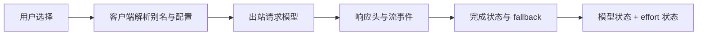

# 检测原理 / Methodology

Am I Nerfed? 的测量对象是客户端和服务端**公开在本次协议交互中的模型标识**。这些字段来自服务方；项目没有独立的模型权重证明机制。

## 默认扫描与模型发现

`am-i-nerfed` 与 `am-i-nerfed scan` 默认检测本机已安装的 Claude Code / Codex，以及它们在本次发现过程中提供的全部模型候选。`models` 和 `scan --dry-run` 只发现、展示清单，不发送推理请求。发现本身可能启动官方客户端并获取目录信息。

这个集合有明确边界：默认是客户端向用户提供的模型目录，不是服务端所有历史模型 ID。来源、缓存、客户端版本和登录状态会影响结果；目录中列出模型，也不能保证当前账号此刻调用成功。`--include-hidden` 将 Codex 目录中的隐藏条目纳入候选，仍不保证可调用；Claude 没有对应的隐藏模型目录接口。别名优先按客户端返回的完整 ID 去重；显式指定别名时仍按该选择检测。

| 提供方 | 主目录来源 | 回退与边界 |
| --- | --- | --- |
| Claude Code | SDK control `initialize` 返回的模型目录，优先使用 `resolvedModel` 去重 | 不发送用户提示词；覆盖客户端提供的候选，不枚举所有可手填的历史 ID |
| Codex | 本地 app-server 验证 ChatGPT 认证后，分页读取 `model/list` | 非认证类发现错误可退回 `models_cache.json`；缓存可能陈旧、不完整，且该回退不能验证本次认证 |

缓存回退会明确标出来源和警告，不能证明发现完整。认证失败不会通过缓存被掩盖成已验证的订阅目录。目录名称及协议本身也可能随客户端版本变化。

扫描分别记录发现和测量。显式选中但未安装的工具、发现失败、目录回退、模型不可用与请求失败不应被隐藏，也不能当作匹配。某项失败后继续检查其余候选，整体结果保留未完成项。通过 `--tool`、`--model PROVIDER:MODEL` 和 `--exclude-model PROVIDER:MODEL` 可以明确收窄范围；范围变化必须与结果一起解释。

全量扫描表示更广的模型目录覆盖，不代表更多提示词类型、长上下文或整个订阅周期的覆盖。每个模型仍只接受设定次数的简短探针。扫描默认通过真实客户端检测：Claude 经由本机捕获代理，Codex 使用 CLI 路径。`--codex-transport http` 显式选择 Codex 内部 HTTP 接口。

扫描保存本地 `inventory.json`、汇总 `report.json`、可分享的 `share.json` / `share.md`，以及 `probes/PROVIDER-NNN/` 下的逐模型诊断报告。模型覆盖范围与单条请求的模型匹配是不同维度；不要从部分成功记录推断整份扫描已完成。

`coverage.complete` 描述所计划检测的证据是否完整，也要求显式请求的直连对照完整。证据完整不等于模型一致：一条明确观察到差异的记录可以具有完整证据，但仍使整次扫描返回非零状态。`--model` 将计划限定为指定项；排除规则按发现出的 ID 精确匹配。

## 四层证据

| 层 | 例子 | 能证明的范围 |
| --- | --- | --- |
| 用户选择 | 目录发现结果或 `--model claude:opus` | 本次计划检测的别名或 ID |
| 出站请求 | JSON 中的 `model`、effort | 客户端实际上发了什么 |
| 上游声明 | HTTP header、流开始 / 完成事件、fallback | 服务方在该交互中返回的标识 |
| CLI 汇总 | 客户端 JSON / 日志元数据 | 客户端解释后的结果，不能替代缺失的原始字段 |

模型回答“我是某某”属于生成内容，不作为模型身份证据。延迟、文风、回答长度或一道题的对错，也不足以确定路由。

## Claude Code 路径

默认检测启动真实 Claude Code，通过仅监听本机的代理捕获本次请求元数据，并向固定的官方上游转发。使用空目录与 `--safe-mode` 关闭项目定制，阻止探针触发项目工具；这种隔离也改变了日常会话上下文。记录用户选择和出站请求，避免把 `opus` 解析为完整 ID 这种正常情况直接认定为降级。别名可以受本地环境变量影响；应同时保留环境配置的解释。[模型配置](https://code.claude.com/docs/en/model-config)

解析响应时需要覆盖整个流。Anthropic 文档说明，流中途发生 fallback 时，开始事件仍可能写着初始模型；后续 fallback 目标和最终迭代记录才能反映切换。因此只看到开始事件不足以证明整个响应由同一模型完成。[官方 streaming fallback 说明](https://platform.claude.com/docs/en/build-with-claude/refusals-and-fallback#streaming)

`--direct-control` 对照运行绕过本地代理的真实客户端。它有助于比较代理是否影响客户端结果，但该运行只提供客户端可见元数据。不能把对照结果描述成“捕获了直连上游原始响应”。

## Codex 路径

直接 HTTP 路径使用本地 Codex 订阅凭据发起短请求，观察 `openai-model` 等元数据以及 `response.created` / `response.completed` 中的模型。完成事件、错误事件和字段冲突都参与解释。内部后端接口并无本项目可承诺的兼容性；变更需要更新解析器。提供方子命令 `codex` 默认使用此路径；全量 `scan` 默认使用 CLI。

`--via-codex` 运行真实 `codex exec`，从客户端输出中读取可见事件。它与直接 HTTP 的系统上下文、传输、客户端默认值可能不同。对照一致是额外证据，不能证明两条路径完全等价。

订阅身份需由已有的 ChatGPT 登录提供。API key 使用的是另一种认证及计费路径。凭据存储可能在文件或系统密钥库中，某条探针路径是否兼容该存储方式，要以本地运行结果为准。[OpenAI 官方认证说明](https://learn.chatgpt.com/docs/auth)

## 结论如何表达

**模型与 effort 必须分开。** 模型一致、effort 未返回，是两个结果；不能合并成“完全未降级”。请求的 effort 也不等于已经证明服务端采用了它。缺少可比较的返回值时，effort 应保留 unknown / 未知。

| 观察 | 合适表述 | 不支持的表述 |
| --- | --- | --- |
| 成功完成、可见模型标识一致 | 本次请求可见模型一致 | 账号没有被降智 |
| 别名解析到另一完整 ID | 本地选择被解析为该 ID | 服务端偷换模型 |
| 出站模型与响应模型不同 | 观察到模型差异，需要排查配置 / fallback | 已证明换成低智模型 |
| 观察到 fallback 事件 | 此次流出现声明的模型切换 | 账号被永久标记 |
| 缺少结束事件或模型字段 | 证据不足 / unknown | 没有发生切换 |
| rate limit、认证失败 | 本次检测未完成 | 模型降级 |

各 provider 的原始状态名可能不同；共享摘要中的 `route_status` 统一为 `MATCH` / `CHANGED` / `UNKNOWN`，`effort_status` 统一为 `MATCH` / `CHANGED` / `NOT_REPORTED` / `NOT_REQUESTED`。`NOT_REPORTED` 表示缺少可比较的返回值；`NOT_REQUESTED` 表示未显式请求。报告显示未知或差异时，优先查看证据缺口和本地配置，不推断服务方动机。

## 采样范围

每次使用新的简短提示词，尽量降低额度开销并减少会话历史干扰。此选择同时限定了结论：它不覆盖长上下文、特定代码库、工具调用、并发压力、长时间使用或特殊内容触发的路由。不要把一次成功检测扩展成整个订阅期的保证。

复查异常时，先固定 CLI 版本、模型完整 ID、effort、传输方式和采样次数。分别观察原配置和排除别名覆盖后的结果。只有在确有必要时增加少量重复请求；次数越多也会消耗更多额度。

## 数据边界

本地诊断报告可能包含请求标识、环境信息、服务元数据或错误；原始响应和日志可能带有更多内容。共享摘要从允许字段构建，不直接复制完整报告。合成测试和 demo 不能当作真实账户结果。

Am I Nerfed? 不上传报告，不采集遥测。提交 bug 时提供版本、简化命令、共享摘要与复现步骤即可；凭据、账号 ID、工作区路径、提示词和原始日志应留在本地。

## English summary

Am I Nerfed? compares user selection, outbound request metadata, upstream identifiers, and CLI summaries as distinct evidence layers. A completed response with matching identifiers supports a per-request routing match. It does not authenticate model weights or rule out account-specific behavior. Aliases, fallback, incomplete streams, and conflicting metadata require separate interpretation.

The bare command scans installed clients and every user-facing model their catalogs expose in this run. This is catalog coverage, not every historical server ID or proof of current access. Discovery and inference failures remain visible while other targets continue. Inventory and dry-run commands do not send inference requests. Each model still receives only a short sampled probe. Scans default to the real CLI paths; Codex's direct HTTP path is an explicit scan option.

Claude's direct control exposes CLI metadata, while the loopback path observes upstream exchanges. Codex's direct HTTP transport is experimental; `--via-codex` observes the real client's available metadata. Neither pair of paths is identical. Model routing and reasoning effort are assessed independently, and missing evidence stays unknown.
